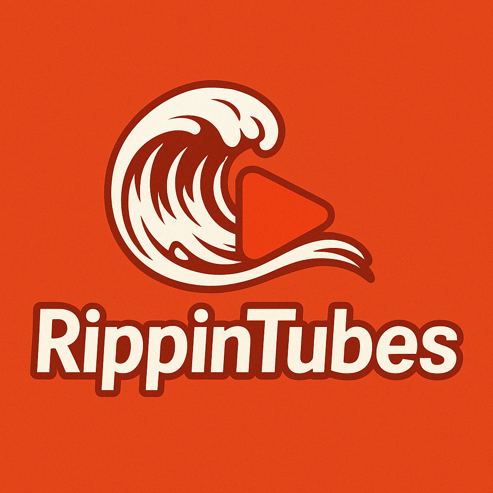

# RippinTubes

RippinTubes is ideal for investigators, researchers, and analysts who need to extract, clean, and process YouTube video transcripts for intelligence, research, or evidence. It is also useful for content creators and developers who need to analyze or process large amounts of YouTube content with minimal manual intervention.

## Features
- Scrapes all videos from a specified YouTube channel (by handle, e.g., `@CyberGirlYT`).
- Extracts transcripts using a multi-fallback approach:
  1. **youtube-transcript-api** (Python, fast and direct)
  2. **Scrapling** (Python, stealthy, via `double_bubble.py`)
  3. **Puppeteer UI scraping** (Node.js, as a last resort)
- Automatically accepts cookie/consent banners (no manual browser interaction required).
- Saves transcripts in the `TRANSCRIPTIONS/` directory, with filenames including the channel and video ID.
- Handles random delays between requests to avoid rate-limiting.
- Consolidates all transcripts into a single JSONL file at the end of the run.
- **Post-processing:** After crawling, automatically runs `cleaned_and_repacked.py` to clean, flatten, and repackage all transcripts into your chosen format (JSONL, JSON, CSV, TXT).

## How It Works
1. **Video Discovery:**
   - Uses Puppeteer to scrape all video IDs from the channel's `/videos` page.
   - If Puppeteer fails, falls back to Scrapling (`double_bubble.py`) to extract video IDs from the HTML.
2. **Transcript Extraction:**
   - For each video, tries youtube-transcript-api first.
   - If blocked, uses Scrapling (`double_bubble.py`).
   - If both fail, attempts UI scraping with Puppeteer.
3. **Output:**
   - Transcripts are saved in `TRANSCRIPTIONS/`.
   - A consolidated file is created as `consolidated_transcripts.jsonl`.
4. **Post-processing:**
   - After all crawling (or if interrupted), `cleaned_and_repacked.py` is automatically run to clean and repackage all transcripts into a single file in your chosen format.

## Requirements
- Node.js (v14 or later)
- Python 3.x
- [youtube-transcript-api](https://github.com/jdepoix/youtube-transcript-api)
- [Scrapling](https://github.com/gs-ai/scrapling)
- Puppeteer with stealth plugin

## Setup
1. **Clone the repository:**
   ```bash
   git clone https://github.com/gs-ai/RippinTubes.git
   cd RippinTubes
   ```
2. **Install Node.js dependencies:**
   ```bash
   npm install
   ```
3. **Set up the Python environment and install dependencies:**
   ```bash
   python3 -m venv rippintubesENV
   source rippintubesENV/bin/activate
   pip install --upgrade pip
   pip install scrapling youtube-transcript-api
   scrapling install
   ```

## Usage
1. **Activate the Python environment:**
   ```bash
   source rippintubesENV/bin/activate
   ```
2. **Run the program:**
   ```bash
   node rippintubes.js
   ```
3. **Enter the YouTube profile handle** when prompted (e.g., `@CyberGirlYT`).
4. **Transcripts** will be saved in the `TRANSCRIPTIONS/` directory.
5. **After crawling,** you will be prompted by `cleaned_and_repacked.py` to select an output format (JSONL, JSON, CSV, TXT) for the cleaned and consolidated transcripts. The output file will be timestamped for logging and reproducibility.

## Directory Structure
```
RippinTubes/
├── LICENSE
├── README.md
├── requirements.txt
├── rippintubes_logo.png
├── rippintubes.js
├── double_bubble.py
├── cleaned_and_repacked.py
├── youtube_transcript_scraping.txt
├── rippintubesENV/
├── TRANSCRIPTIONS/
│   └── ...
```

## Transcript Extraction Logic
- **youtube-transcript-api:** Fastest, but may be blocked by YouTube for some IPs.
- **Scrapling (`double_bubble.py`):** Stealthy, bypasses many anti-bot measures, used as a fallback.
- **Puppeteer UI scraping:** Last resort, mimics a real user to extract the transcript from the YouTube UI.
- **All transcript files in TRANSCRIPTIONS/** are processed by `cleaned_and_repacked.py`, which:
  - Detects and flattens stringified Python lists of dictionaries (common from youtube-transcript-api output).
  - Cleans and normalizes the text for downstream use (LLM training, analytics, etc).

## Tips
- If you encounter issues with video discovery, check `debug_youtube_videos_page.html` and `debug_youtube_videos_page.png` for clues.
- All Python scripts are run using the `rippintubesENV` virtual environment to ensure dependencies are available.
- The program does not automatically crawl related channels after finishing the initial channel.
- You can re-run `cleaned_and_repacked.py` at any time to reprocess all transcripts in the `TRANSCRIPTIONS/` directory.

## License
MIT License

---

For more details, see the code and comments in `rippintubes.js`, `double_bubble.py`, and `cleaned_and_repacked.py`.
